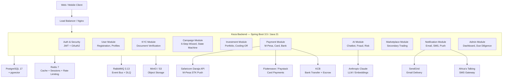
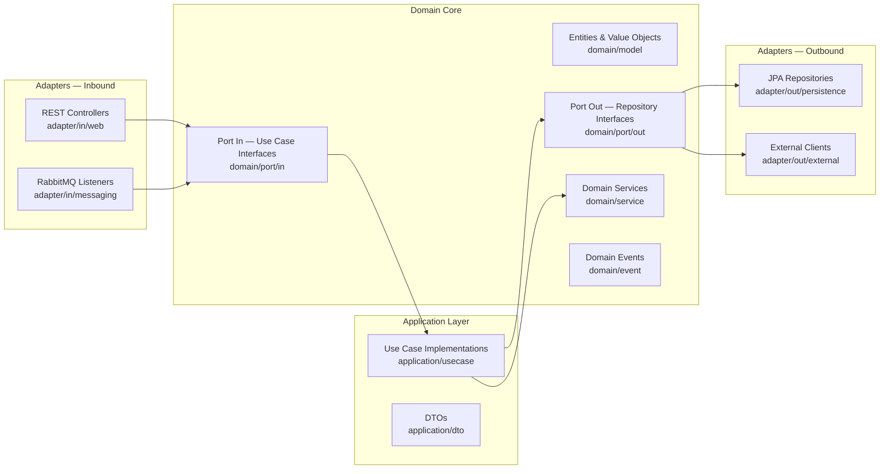
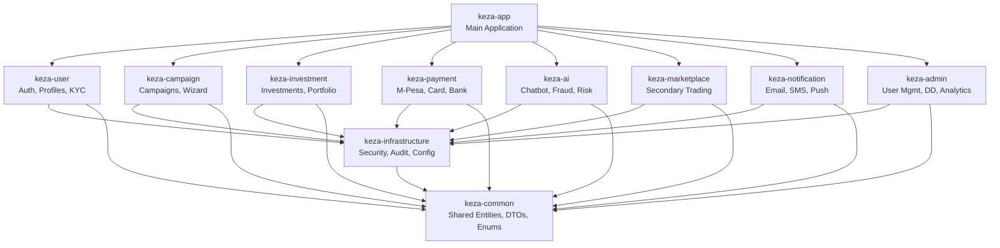
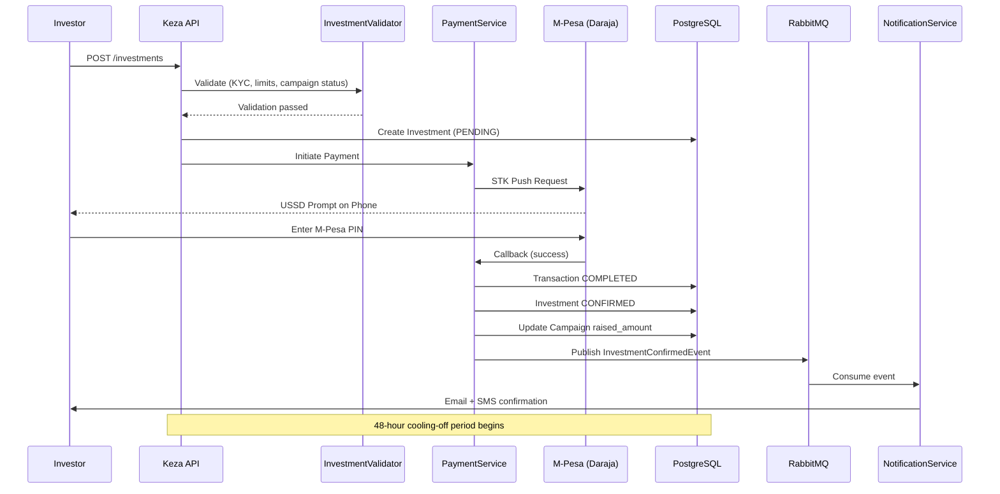
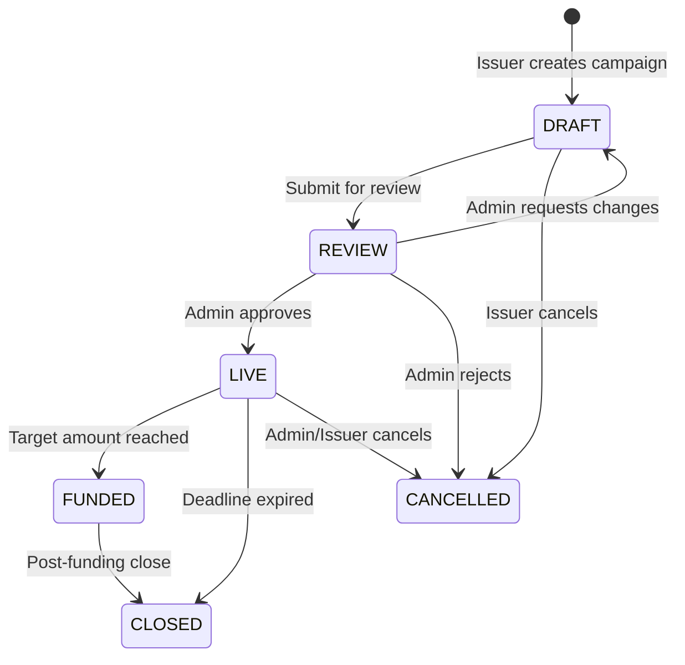
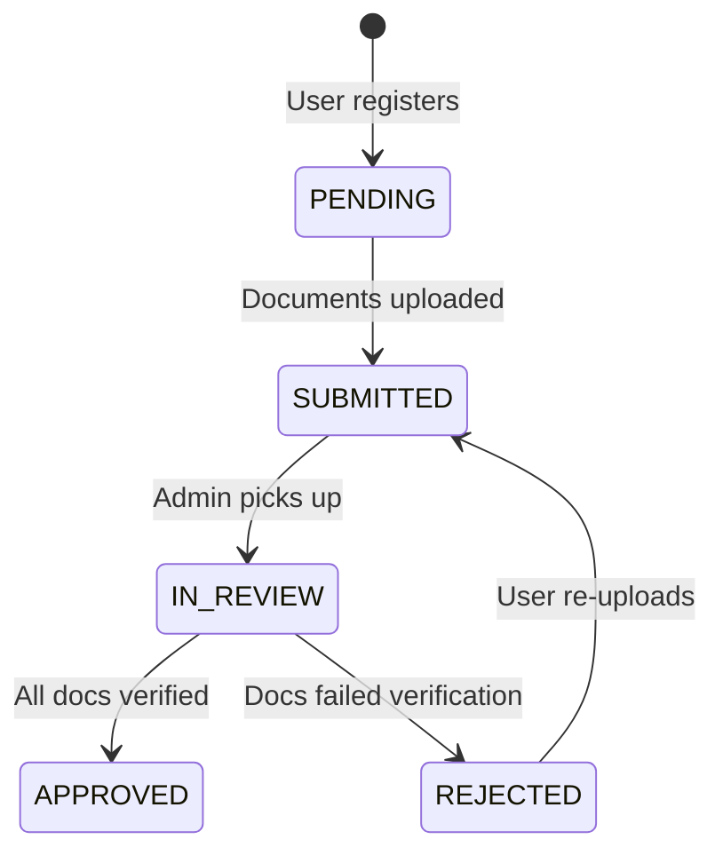
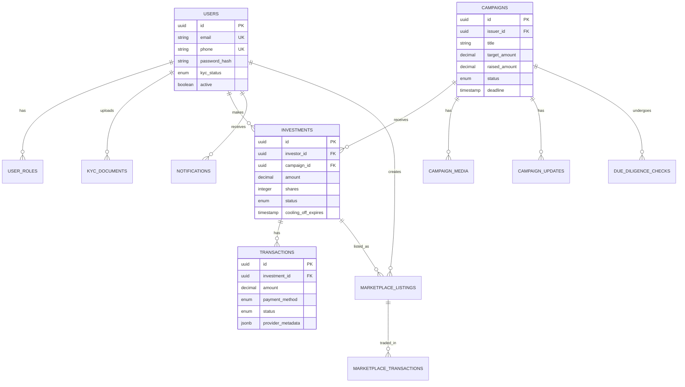

# Keza Backend Architecture

## System Architecture

## Module Architecture (Hexagonal)

## Module Dependency Graph

## Investment Flow

## Campaign State Machine

## KYC State Machine

## Data Model (Core Entities)

